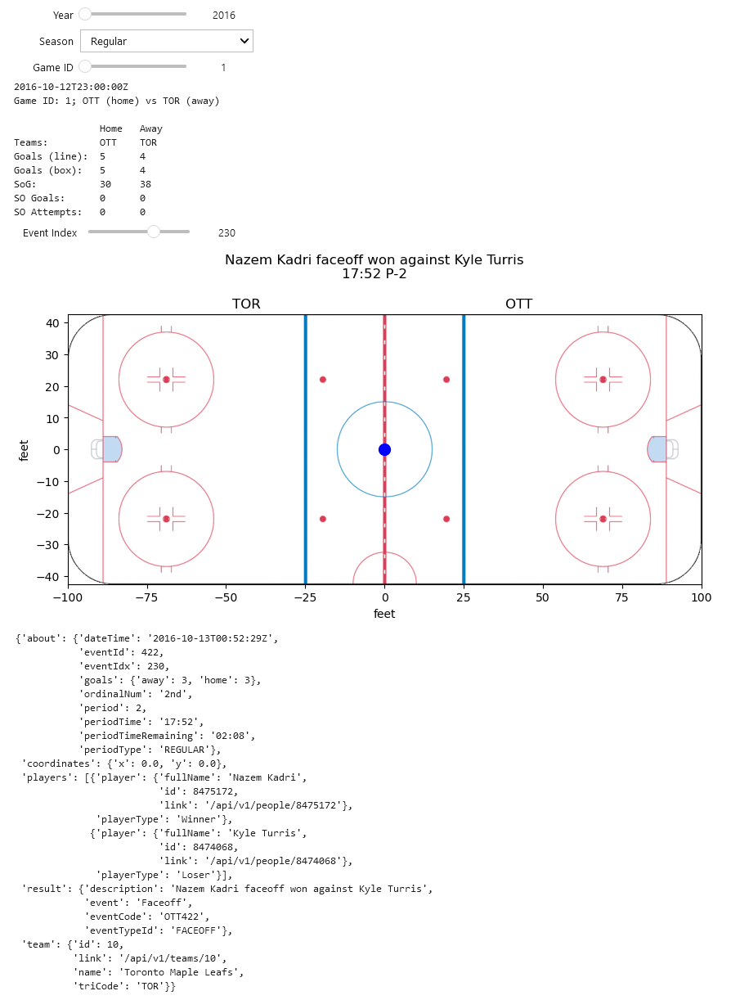
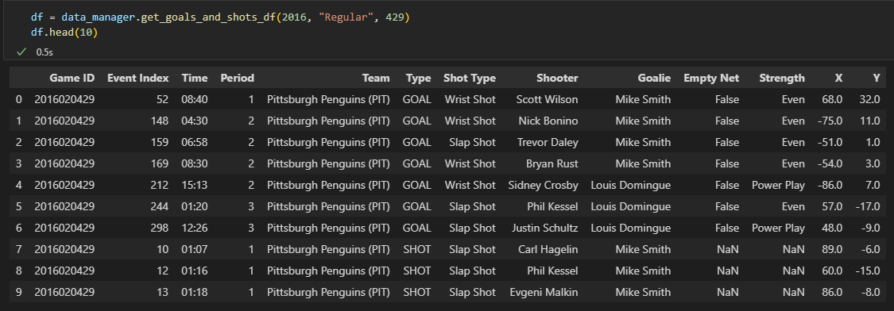

## Question 1 : Acquisition des données

Les lignes qui vont suivre sont un bref tutoriel permettant de télécharger les données 
"play-by-play" des matchs de NHL à l'aide de notre code, disponible sur GitHub : <br>
[An Ni Wu](https://github.com/anw1998/IFT6758-A2022-G08) <br>
[Thomas Rives](https://github.com/THOMAS921) <br>
[Rui Ze Ma](https://github.com/ruizema) <br>
[Alain Fidahoussen](https://github.com/AlainFidahoussen/IFT6758-A2022-G08.git){:target="_blank"} <br>

A la fin de ce tutoriel, vous serez en mesure d'obtenir toutes les 
informations officielles rendues disponibles par l'API des statistiques de la NHL 
pour les saisons que vous désirez.

### Étape 1 : Récupération du code et création de l'environnement Python <a name="Q1-Step1"></a> 
Le code Python peut-être récupéré en clonant un des répertoires Git ci-dessus

```console
git clone https://github.com/anw1998/IFT6758-A2022-G08
```
Cette commande une fois exécutée, vous devriez avoir téléchargé un dossier nommé **IFT6758-A2022-G08-master**. 
Il suffit ensuite de créer l'environnement [Conda](https://www.anaconda.com/){:target="_blank"}. Pour cela, vous pouvez 
utilisez la commande suivante depuis le dossier root du projet : 
```console
make create_environment
source activate NHL
```
### Étape 2 : Définition de la variable d'environnement <a name="Q1-Step2"></a> 
Pour éviter de multiples requêtes via une API publique, les données sont téléchargées dans un **répertoire local** que 
vous devez spécifier :
 - soit en tant qu'argument du constructeur (cf. [étape 3](#Q1-Step3).)
 - soit en définissant la [variable d'environnement](https://en.wikipedia.org/wiki/Environment_variable#Syntax) *NHL_DATA_DIR*
 
<u>Note 1</u> : il est possible de définir la variable d'environnement *NHL_DATA_DIR* dans un fichier '.env' dans le 
répertoire root du projet. Elle sera alors automatiquement lue par le code. <br>
<u>Note 2</u> : le répertoire local sera automatiquement créé si non existant.

### Étape 3 : Importation du module et création du data manager <a name="Q1-Step3"></a> 
Depuis le dossier **IFT6758-A2022-G08-master**, lancez l'interpréteur Python (ou créez un 
fichier .py), importez le module *src.data.NHLDataManager* et instanciez un objet de type *NHLDataManager* :

```python
import src.data.NHLDataManager as DataManager

# Les données seront téléchargées dans 'directory_name'
data_manager = DataManager.NHLDataManager('directory_name')
# OU
# Les données seront téléchargées dans la répertoire définit par la 
# variable d'environnement NHL_DATA_DIR
data_manager = DataManager.NHLDataManager()
```
### Étape 4: Téléchargement des données <a name="Q1-Step4"></a>
Pour le moment, seul le téléchargement des saisons régulières et des playoffs est supporté.
Le téléchargement se fait sous la forme d'un fichier [json](https://en.wikipedia.org/wiki/JSON){:target="_blank"} par match, dont le nom est définit 
par un identificateur unique ([Game IDs](https://gitlab.com/dword4/nhlapi/-/blob/master/stats-api.md#game-ids){:target="_blank"})

**La façon recommandée** pour récupérer les données des saisons 2016 à 2020 est de lancer la commande :
```console
make data
```
Les données brutes se trouveront alors dans le sous-répertoire 'raw' du répertoire local défini à l'[étape 2](#Q1-Step2). <br>

Il est également possible de faire directement appel à certaines fonctions pour :

 - Le téléchargement sur disque (json) d'une ou plusieurs saisons : 

```python
# Liste des saisons à télécharger
seasons_year = [2016, 2017, 2018]

# Type de saison (régulière)
season_type = "Regular"
data_manager.download_data(
   seasons_year=seasons_year, 
   season_type=season_type)

# Type de saison (playoffs)
season_type = "Playoffs"
data_manager.download_data(
   seasons_year=seasons_year, 
   season_type=season_type)
```

 - Le téléchargement sur disque (json) et en mémoire (dictionaire python) d'une saison entière :

```python
# Saison à télécharger
season_year = 2016

# Type de saison
season_type = "Regular"

data_season = data_manager.load_data(
   season_year=season_year, 
   season_type=season_type)
```

 - Le téléchargement sur disque (json) et en mémoire (dictionaire python) d'un match précis :

```python
# Saison à télécharger
season_year = 2016

# Type de saison
season_type = "Regular"

# Numéro du match
game_number = 12

data_game = data_manager.load_game(
   season_year=season_year, 
   season_type=season_type,
   game_number=game_number)
```

Il ne suffit alors à présent plus qu'à vérifier que le téléchargement s'est correctement effectué. Par exemple : 
```python
data_raw_dir = os.path.join(os.environ['NHL_DATA_DIR'], 'raw')
season_year = 2016,
season_type 'Regular'
path_data = os.path.join(data_dir, str(season_year), season_type)

json_files = os.listdir(path_data)

print(json_files[0:3])
['2016020001.json', '2016020002.json', '2016020003.json']

print(len(json_files))
1231
```

L'ensemble des commandes ci-dessus peuvent être retrouvées dans le jupyter notebook 
'notebooks/Q1_Acquisition_de_données.ipynb'

## Question 2 : Outil de débogage interactif

Notre outil permet de choisir une année (2016-2020), une saison ("Regular" ou "Playoffs"), 
un identifiant de match donné et de défiler à travers tous les événements du match choisi. 
Le curseur d'identifiant de match s'ajuste automatiquement selon la saison de l'année choisie 
et celui des indices de l'événement selon le match choisi. 
Un résumé du match est imprimé entre les curseurs "Game ID" et "Event Index". 
Les coordoonées sur la patinoire et les informations de l'événement sont mises à jour en 
fonction de l'indice de l'événement.

```
%load_ext autoreload
%autoreload 2

# # To load the environment variable defined in the .env file
from dotenv import load_dotenv
load_dotenv();

import src.data.NHLDataManager as DataManager

import os
import json
import pprint

import numpy as np

import ipywidgets as widgets
from ipywidgets import interact

import matplotlib.pyplot as plt
import matplotlib.image as mpimg

data_manager = DataManager.NHLDataManager()

@ interact(season_year=widgets.IntSlider(min=2016, max=2020, step=1, value=1, description='Year'), 
           season_type=widgets.Dropdown(options=data_manager.season_types, value=data_manager.season_types[0], description='Season'))
def interactive_tool(season_year: int, season_type: str):
      
    game_numbers = data_manager.get_game_numbers(season_year, season_type)

    @ interact(game_num=widgets.SelectionSlider(options=game_numbers, value=game_numbers[0], description='Game ID'))
    def load_json(game_num: int): 
                    
        data = data_manager.load_game(season_year, season_type, game_num)
                   
        # -- Header
        print(data['gameData']['datetime']['dateTime'])
        
        abb_home = data['gameData']['teams']['home']['abbreviation']
        abb_away = data['gameData']['teams']['away']['abbreviation']
        print(f'Game ID: {game_num}; {abb_home} (home) vs {abb_away} (away)\n')
        
        # -- Table
        print('{}{}{}'.format(''.ljust(15), 'Home'.ljust(7), 'Away'.ljust(7)))
        print('{}{}{}'.format('Teams:'.ljust(15), abb_home.ljust(7), abb_away.ljust(7)))
        
        goals_home = str(data['liveData']['linescore']['teams']['home']['goals'])
        goals_away = str(data['liveData']['linescore']['teams']['away']['goals'])
        print('{}{}{}'.format('Goals (line):'.ljust(15), goals_home.ljust(7), goals_away.ljust(7)))
        
        goals_home1 = str(data['liveData']['boxscore']['teams']['home']['teamStats']['teamSkaterStats']['goals'])
        goals_away1 = str(data['liveData']['boxscore']['teams']['away']['teamStats']['teamSkaterStats']['goals'])
        print('{}{}{}'.format('Goals (box):'.ljust(15), goals_home1.ljust(7), goals_away1.ljust(7)))

        sog_home = str(data['liveData']['linescore']['teams']['home']['shotsOnGoal'])
        sog_away = str(data['liveData']['linescore']['teams']['away']['shotsOnGoal'])
        print('{}{}{}'.format('SoG:'.ljust(15), sog_home.ljust(7), sog_away.ljust(7)))
         
        so_goals_home = str(data['liveData']['linescore']['shootoutInfo']['home']['scores'])
        so_goals_away = str(data['liveData']['linescore']['shootoutInfo']['away']['scores'])
        print('{}{}{}'.format('SO Goals:'.ljust(15), so_goals_home.ljust(7), so_goals_away.ljust(7)))
            
        so_attempts_home = str(data['liveData']['linescore']['shootoutInfo']['home']['attempts'])
        so_attempts_away = str(data['liveData']['linescore']['shootoutInfo']['away']['attempts'])
        print('{}{}{}'.format('SO Attempts:'.ljust(15), so_attempts_home.ljust(7), so_attempts_away.ljust(7)))
        
        @ interact(event_idx=widgets.IntSlider(min=0, max=max(0, len(data['liveData']['plays']['allPlays'])-1), step=1, value=0, description='Event Index'))
        def print_info(event_idx: int):
    
            plt.figure(figsize = (10, 5), dpi=100)
            img = mpimg.imread("./figures/nhl_rink.png")
            plt.imshow(img, extent=[-100.0, 100.0, -42.5, 42.5])
            
            plt.xlabel('feet')
            plt.ylabel('feet')
            
            if data['gameData']['status']['abstractGameState'] != 'Preview':
                title_desc = data['liveData']['plays']['allPlays'][event_idx]['result']['description'] 
                title_period_time = data['liveData']['plays']['allPlays'][event_idx]['about']['periodTime']
                title_period = data['liveData']['plays']['allPlays'][event_idx]['about']['period']
                plt.suptitle(f'{title_desc}\n{title_period_time} P-{title_period}')
            else:
                pass
            
            title_away_abb = data['gameData']['teams']['away']['abbreviation']
            title_home_abb = data['gameData']['teams']['home']['abbreviation']
            
            periods = data['liveData']['linescore']['periods']
            
            try:
                home_sides = [period['home']['rinkSide'] for period in periods]
                away_sides = [period['away']['rinkSide'] for period in periods]

                if 'startTime' in data['liveData']['linescore']['shootoutInfo']:
                    home_side_shootout = data['liveData']['linescore']['periods'][2]['home']['rinkSide']
                    away_side_shootout = data['liveData']['linescore']['periods'][2]['away']['rinkSide']
                    home_sides.append(home_side_shootout)
                    away_sides.append(away_side_shootout)
                else:
                    pass

                if home_sides[data['liveData']['plays']['allPlays'][event_idx]['about']['period']-1] == 'right':
                    plt.title('{}{}'.format(title_away_abb.center(60), title_home_abb.center(60)), horizontalalignment='center')
                else:
                    plt.title('{}{}'.format(title_home_abb.center(60), title_away_abb.center(60)), horizontalalignment='center')
            except:
                pass
              
            try: # plot event if exists
                x_coord = data['liveData']['plays']['allPlays'][event_idx]['coordinates']['x']
                y_coord = data['liveData']['plays']['allPlays'][event_idx]['coordinates']['y']
                plt.plot(x_coord, y_coord, marker='o', color='blue', markersize=10)
                
                plt.show()
                
                pprint.pprint(data['liveData']['plays']['allPlays'][event_idx])
            except:
                pass
```


## Question 3 : Rangez les données 



Pour ajouter les informations sur la force réelle, on peut tout d'abord récupérer l'information sur les pénalités dans la section [liveData][penaltyPlays] du JSON. On peut trier le DataFrame en ordre croissant de période ("Period") d'abord et de temps ("Time") ensuite. Ensuite, au lieu de réinitialiser le temps après chaque période comme dans le JSON, on peut ramener le temps sur la durée totale du jeu (incluant le overtime) pour faciliter le calcul de pénalité.
On gère les pénalités selon la situation: 
1. Les joueurs sont suspendus en fonction du type de pénalité qu'ils font.

2. Si une pénalité débute à la fin d'une période et qu'elle continue au début de la période suivante, on additionne simplement la durée de pénalité puisque le temps est ramené sur la durée complète du jeu.

3. Si une pénalité débute à la fin de la 3e période règlementaire, la prolongation qui est sensée voir 3 joueurs contre 3 joueurs, aura 4 contre 3.

4. En période de prolongation, l'équipe qui commet une pénalité verra l'équipe adverse gagner un joueur.

5. Nous savons qu'il ne peut y avoir que 4 joueurs sur le terrain (en comptant le gardien), et que la prolongation est 4 contre 4.  


Trois fonctionnalités: 
1. Pour déterminer un rebond, on peut vérifier s'il n'a pas eu un shot de la même équipe à moins de 3 secondes avant un but. 

2. Pour déterminer un tir dans le rush, on peut vérifier si une équipe a tiré et si quelques secondes après, un tir a été fait par l'équipe adverse.

3. Pour déterminer si un but ou un shot est marqué accidentellement par un coup de pied, on peut récupérer les points qui ont une coordonnée -89 > x > 89 puisque cela veut dire que le palet est derrière la ligne de but et la seule façon de considérer ce tir comme un shot ou un but est que s'il a été marqué par le patin d'un joueur.

4. Latéralité des joueurs (info dans [gameData][players][ID___][shootsCatches])?

## Question 4 : Visualisations simples

### 1. Graphique des types de tirs

### 2. Graphique des distances

### 3. Graphique des types de tirs et des distances

## Question 5 : Visualisations avancées

### 1. Heatmap interactives des saisons 2016 à 2020
Les 4 figures suivantes montrent les heatmap des positions des tirs de chaque équipe, pour les saisons 2016 à 2020. <br>
<u>Note</u> : les figures ci-dessous peut être regénérées en exécutant la dernière cellule 
du jupyter notebook './notebooks/Q5_Visualisations_Avancees.ipynb'
<a name="Q5-Season2016"></a> 


<a name="Q5-Season2017"></a> 


<a name="Q5-Season2018"></a> 


<a name="Q5-Season2019"></a>


<a name="Q5-Season2020"></a>
 

### 2. Discussion générale
Les heatmap interactives permettent une comparaison de la position des tirs de chaque équipe, 
relativement à la moyenne de la ligue. D'une manière générale, on peut considérer que davantage de 
tirs dans les zones dangeureuses (par exemple, devant les cages) entraîne davantage de buts. <br>

De façon plus générale, ces cartes permettent d'analyser les équipes sous différents angles :
<a name="Q21"></a>
 - Pour une équipe donnée, comment son jeu à évoluer sur les dernières années.
Est-ce qu'une évolution de la heatmap entraîne une remontée au classement ?
<a name="Q22"></a>
 - Pour une saison donnée, comment une équipe se compare aux autres équipes de la ligue.
 Est-ce qu'une "meilleure" heatmap entraîne un meilleur classement ?
<a name="Q23"></a>
 - Pour une équipe donnée et une saison donnée, quelles ont été les zones d'où la plupart des tirs ont été pris.
Est-ce que les zones "chaudes" de la heatmap correspondent à des joueurs forts dans ces zones ?

### 3. Analyse de l'Avalanche Colorado
Les deux figures ci-dessous montrent les heatmap de l'Avalanche Colorado pour les saisons 2016 (à gauche) 
et 2020 (à droite).<br>

<style>
figure{
    display: inline-block;
}
</style>

<figure>
    
    <figcaption>Shots map Colorado - 2016</figcaption>
</figure>
<figure>
    
    <figcaption>Shots map Colorado - 2020</figcaption>
</figure>

En analysant la [heatmap](#Q5-Season2016) de la saison 2016, on constate que l'Avalanche a tiré beaucoup moins devant les cages, et 
davantage loin des cages, comparées aux autres équipes de la ligue.
Ceci explique probablement leur [dernière place](https://www.nhl.com/standings/2016/league){:target="_blank"} au classement final.<br>

En analysant la [heatmap](#Q5-Season2020) de la saison 2020, on constate au contraire que l'Avalanche a tiré davantage que les 
autres équipes en face des cage et depuis le centre de la zone offensive. Ces zones sont les plus dangeureuses, 
et explique probablement leur [première place](https://www.nhl.com/standings/2020/league){:target="_blank"} au classement final. <br>

Comme supposé à la [section précédente](#Q21), il semblerait que pour une équipe donnée, 
une meilleure heatmap est corrélée avec un meilleur classement.

### 4. Comparaison des Sabres de Buffalo et du Lightning de Tampa Bay
Les six figures ci-dessous montrent les heatmap des Sabres de Buffalo (à gauche) et du 
Lightning de Tampa Bay (à droite) pour les saisons 2018, 2019 et 2020.<br>

<figure>
    
    <figcaption>Shots map Tampa - 2018</figcaption>
</figure>
<figure>
    
    <figcaption>Shots map Buffalo - 2018</figcaption>
</figure>

<figure>
    
    <figcaption>Shots map Tampa - 2019</figcaption>
</figure>
<figure>
    
    <figcaption>Shots map Buffalo - 2019</figcaption>
</figure>

<figure>
    
    <figcaption>Shots map Tampa - 2020</figcaption>
</figure>
<figure>
    
    <figcaption>Shots map Buffalo - 2020</figcaption>
</figure>

On constate nettement la capacité du Lightning à tirer davantage devant les cages et depuis 
le centre de la zone offensive, comparées aux autres équipes de la ligue. <br>
Au contraire, les Sabres ont une tendance à prendre leurs tirs loin des cages et moins 
depuis le centre de la zone offensive, comparées aux autres équipes de la ligue. 
Cette différence explique en partie pourquoi, sur les trois dernières années, 
[Tampa](https://en.wikipedia.org/wiki/Tampa_Bay_Lightning#Season-by-season_record){:target="_blank"} a mieux 
réussi que [Buffalo](https://en.wikipedia.org/wiki/Buffalo_Sabres#Season-by-season_record){:target="_blank"}.

Comme supposé à la [section précédente](#Q22), il semblerait que pour une saison donnée, 
une équipe ayant une meilleure heatmap aura un meilleur classement.<br>

Par ailleurs, on remarque pour les Sabres une nette tendance à prendre leurs tirs depuis la droite des cages. 
Cela semble être logique, étant donné que leur meilleur tireur est 
[Jack Eichel](https://en.wikipedia.org/wiki/Jack_Eichel){:target="_blank"} qui tire à droite.<br>

De plus, les tirs du Lightning sont plus équilibrés, car leurs meilleurs tireurs sont 
[Steven Stamkos](https://en.wikipedia.org/wiki/Steven_Stamkos){:target="_blank"} qui tire à droite 
et [Nikita Kucherov](https://en.wikipedia.org/wiki/Nikita_Kucherov){:target="_blank"} qui tire à gauche.<br>
 
Comme supposé à la [section précédente](#Q23), les zones "chaudes" de la heatmap correspondent 
donc à des joueurs forts dans ces zones.<br>

L'analyse des heatmap des tirs n'est évidemment pas suffisante  pour effectuer une analyse approfondie 
de la performance des équipes. Il faudrait également regarder : 
 - Le ratio tirs/buts pour savoir si une équipe est efficace.
 - Le nombre d'arrêt, pour savoir si un goal est performant.
 - La solidité de l'équipe en zone défensive.
 - La différence de niveau entre les différentes lignes d'attaque et de défense.
 - Et bien d'autres critères !


