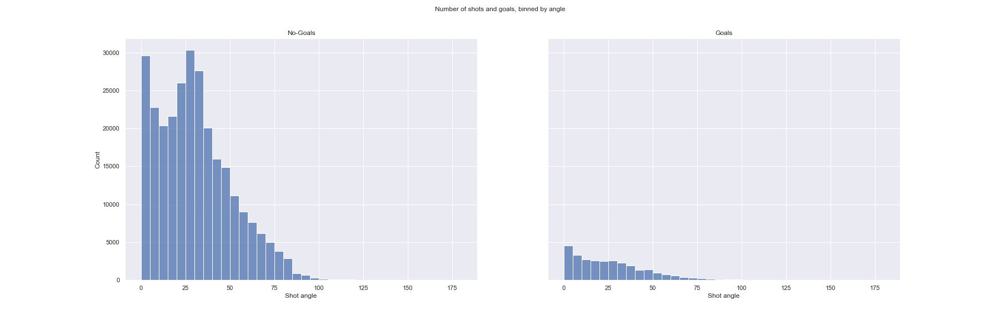
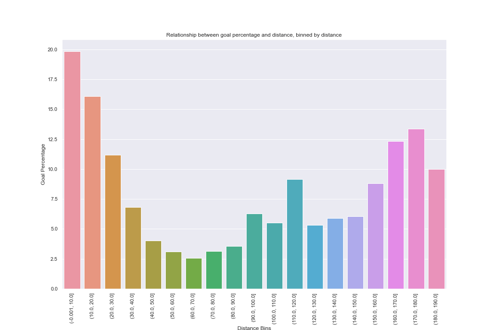
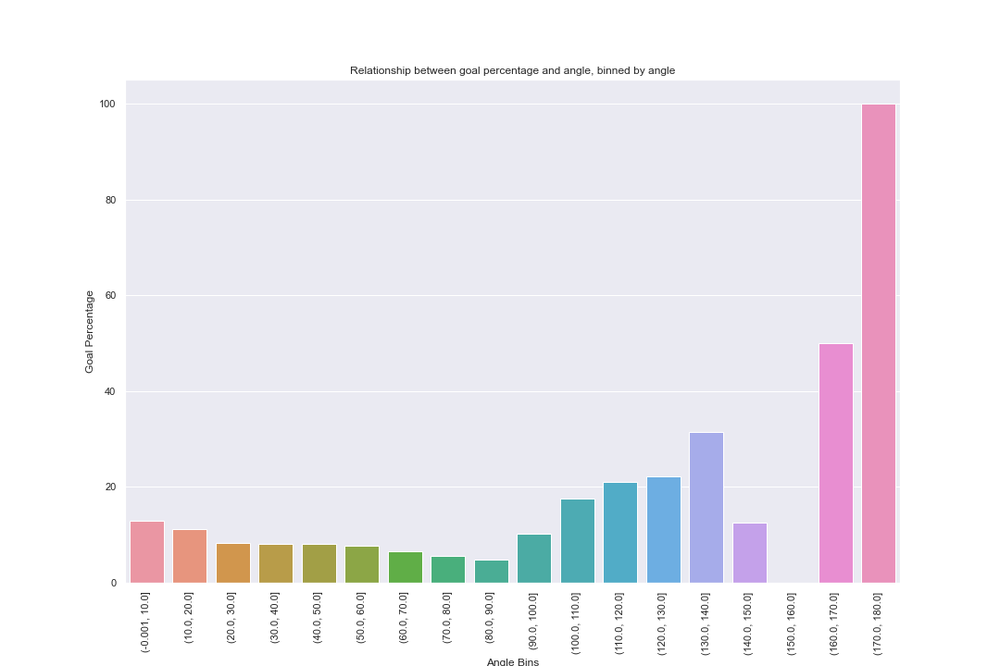

## Question 2 (Ingénierie des caractéristiques I)

1. La très grande majorité des tirs sont depuis la zone offensive (beaucoup de tirs à une distance plus petite que 89). La plupart des buts sont marqués à une courte distance du filet. La tendance générale est que le nombre de buts est inversement proportionnel à la distance sauf pour quelques buts qui sont tirés de très loin.  De plus, il semble avoir plus de chance marquer lorsque le tireur est vis-à-vis le filet (perpendiculaire à la ligne de but) où l'angle est de 0, ce qui a du sens. EN général, plus l'angle est grand, moins le joueur a tendance à tirer et moins il y a de buts.  D'après le jointplot, les tirs sont concentrés à une distance courte et à un petit angle du but. Plus la distance est longue, plus les joueurs ont tendance à tirer de façon droite devant le but. De même, plus l'angle est grand (plus parallèle à la ligne de but), plus la distance de tir est courte. 

2. La tendance que nous remarquons avec ce graphique est que le pourcentage de buts décroit avec la distance initialement, mais commence à remonter lorsque la distance augmente. C'est logique, car les chances qu'un tir soit un but sont plus grandes lorsque le tireurs est plus proche du filet.Nous considérons que l'angle est de 0 lorsque le tir est fait perpendiculaire à la ligne de but donc on s'attendrait au même comportement que la distance, c'est-à-dire plus l'angle est petit, plus la proportion de but est grand. Toutefois, that's not really what we observe with the graph and I don't really know how to interpret it... 

3. Lorsque le gardien est présent, la grande partie des buts sont marqués depuis la zone offensive. Par contre, il y a une légère augmentation du nombre de buts marqués à une distance très loin, de la zone défensive. En sachant que la zone défensive commence à -25 (rappel: nous avons standardisé les coordonnées selon une rotation de 180 degré pour les tirs avec `rinkSide="right"`), en effectuant `df_goals[(df_goals['Is Empty'] == 0) & (df_goals['st_X'] < -25)]` on compte 747 buts depuis la zone défensive avec un gardien présent, ce qui laisse supposer qi'il y ait des mauvaises coordonnées.(lien vidéo trouvé par Thomas à insérer)
