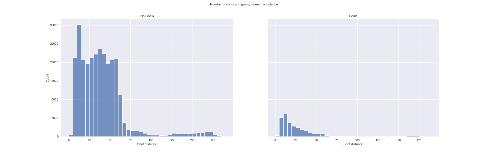

## Question 2 : Ingénierie des caractéristiques I 

1. Nous constatons que la très grande majorité des tirs (buts et non-buts) sont depuis la zone offensive (beaucoup de tirs à une distance plus petite que 89). La plupart des buts sont marqués à une courte distance du filet bien que certains soient également marqués à de loin (il serait alors intéressant de considérer lorsque les cages sont vides ou non). La tendance générale est que le nombre de tirs est inversement proportionnel à la distance. 
De plus, les tireurs ont plus de chance de marquer lorsqu'ils sont face au filet, c'est à dire quand l'angle est de 0 (ce qui semble logique). En général, plus l'angle est grand, moins le joueur a tendance à tirer et moins il y a de buts.  Enfin d'après le jointplot, les tirs sont concentrés à une distance courte et à un petit angle du but. Plus la distance est longue, plus les joueurs ont tendance à tirer en face du but. De même, plus l'angle est grand, plus la distance de tir est courte. 

2. La tendance que nous remarquons avec ce graphique est que le pourcentage de buts décroit avec la distance initialement, mais commence à remonter lorsque la distance augmente. Cela semble logique, car les chances qu'un tir soit un but sont plus grandes lorsque les tireurs sont proches du filet. Nous pouvons expliquer également les taux de buts très importants pour les distances importantes car les tireurs tirent peu de loin (à cause de la difficulté) et lorsque cela se réalise, cela veut dire qu'il y a de grandes chances de marquer (comme par exemple lorsque les buts sont vides). Concernant les taux de buts em fonction de l'angle de tir, nous obtenons un comportement similaire à la distance, c'est-à-dire, plus l'angle est petit et plus la proportion de buts est grande.En effet, les taux de buts décroient avec la hausse de la valeur de l'angle. Mais tout comme avec la distance, nous observons une hausse du taux de buts pour les grandes valeurs d'angles qui peut être expliquée de la même manière que pour la distance: plus l'on se trouve sur le côté des buts et plus il est difficile de marquer (il y a donc peu de tirs qui se réalisent dans ces zones). Pour que ces tirs se réalisent, il y a donc de grandes chances pour que le tireur marque (encore une fois en prenant l'exemple de but vide).    

3. Lorsque le gardien est présent, la grande majorités des buts sont marqués depuis la zone offensive. En revanche, nous constatons une augmentation du nombre de buts marqués à une distance très loin, depuis la zone défensive. En sachant que la zone défensive commence à X = -25 (rappel: nous avons standardisé les coordonnées en faisant une rotation de 180 degrés pour les tirs avec `rinkSide="left"`), en effectuant l'opération `df_goals[(df_goals['Is Empty'] == 0) & (df_goals['st_X'] < -25)]`, nous comptons 801 buts marqués depuis la zone défensive avec un gardien présent. Ces résultats étant étranges, nous pourrions alors nous demander si d'éventuelles erreurs ne sont pas présentes dans l'API.   Pour le prouver, prenons le jeu avec l'ID 2018020192, nous remarquons sur [cette vidéo](https://www.nhl.com/video/fla--wpg/t-277350912/c-62563403?q=2018020192) que l'équipe Winnipeg Jets, qui est l'équipe "home" se stiue à gauche de la patinoire pour la période 1. Par contre, dans la section liveData > linescore > periods > 0 > home > rinkSide de l'API du jeu, il est indiqué que cette équipe est à droite pour cette période.  Comme nous standardisons les coordonnées en fonction de l'information "rinkSide", si elle est erronée, alors les coordonnées standardisées ne seront pas bonnes non plus. Par exemple, à 01:39 de la vidéo, les Winnipeg Jets marque un but qui correspond à l'événement 59 de l'API. Les coordonnées de l'événement fournies par l'API sont (81, 5) ce qui est bon puisque le filet de l'équipe adverse est à droite. Toutefois,  l'information "rinkSide" étant inversée, les coordonnées standardisées sont (-81, -5) ce qui en fait un but marqué dans la zone défensive avec un gardien sur le terrain. 

## Question 3 : Modèles de base

Afin de prédire la probabilité qu'un tir soit un but (buts espérés), nous avons entraîné 
trois modèles de régression logistique, qui utilisent respectivement les caractéristiques suivantes : 
 - la distance au but 
 - l'angle de tir
 - la distance au but et l'angle de tir.
 
### Premiers résultats

 ```python
distance_data = features_data[['Shot distance', 'Is Goal']].dropna()
X = distance_data[['Shot distance']]
y = distance_data['Is Goal']

clf = LogisticRegression(random_state=RANDOM_SEED).fit(X_train, y_train)

accuracy = clf.score(X_valid, y_valid)
print(f'Accuracy on validation set = {np.around(100.*accuracy, 2)}%')

>>> Accuracy on validation set = 90.62%
```

À première vue, le modèle semble performant, car l'exactitude ("accuracy") obtenue est de 91%.
Cependant, on remarque un fort débalancement des classes : 


Il suffit dès lors de prédire systématiquement qu'un tir soit raté pour obtenir une performance similaire : 

 ```python
def dumb_model(X, y):
    pred = np.zeros_like(X)
    return (y == pred.ravel()).mean()


dumb_accuracy = dumb_model(X_valid, y_valid)
print(f'Dumb Accuracy on validation set = {np.around(100.*dumb_accuracy, 2)}%')

>>> Dumb Accuracy on validation set = 90.62%
```

La métrique utilisée ("accuracy") n'est pas adaptée lorsque les classes sont débalancées. Il faudrait 
plutôt évaluer le modèle en calculant le [f1-score](https://scikit-learn.org/stable/modules/generated/sklearn.metrics.f1_score.html){:target="_blank"} ou le roc-auc. Par exemple : 

 ```python
f1Score = f1_score(y_valid, clf.predict(X_valid), average='macro')
print(f'F1-Score on validation set = {np.around(100.*f1Score, 2)}%')

rocauc = roc_auc_score(y_valid, clf.predict_proba(X_valid)[:,1])
print(f'ROC-AUC on validation set = {np.around(100.*rocauc, 2)}%')

>>> F1-Score on validation set = 47.54%
>>> ROC-AUC on validation set = 67.82%
```
### Graphiques de performance

Les 4 modèles que nous allons comparer sont : 
 - Une régression logistique appliquée à la distance au but.
 - Une régression logistique appliquée à l'angle de tir (en valeur absolue, pour des raisons de symmétrie).
 - Une régression logistique appliquée à la distance au but et à l'angle de tir.
 - Un modèle aléatoire uniforme. <br>

Voici un exemple de code utilisé. Le code complet se trouve dans le [notebook](https://github.com/AlainFidahoussen/IFT6758-A2022-G08/blob/57a581c0763aca4867bdef407dfedcda29b6495b/notebooks/Milestone-2/Q3_Modeles_Base.ipynb){:target="_blank"} 'notebooks/Milestone-2/Q3_Modeles_Base.ipynb'.
```python
RANDOM_SEED = 42

# Subset of the dataframe
distance_data = features_data[['Shot distance', 'Shot angle', 'Is Goal']]

# Features and target
X = distance_data[['Shot distance', 'Shot angle']]
y = distance_data['Is Goal']

# Stratify split
X_train, X_valid, y_train, y_valid = train_test_split(X, y, test_size=0.2, random_state=RANDOM_SEED, stratify=y)

# Logistic Regression
clf = LogisticRegression(random_state=RANDOM_SEED)
clf.fit(X_train, y_train)

y_pred = clf.predict_proba(X_valid)[:,1]
```
Nous souhaitons évaluer nos modèles à l'aide de 4 graphiques : 

 - <u>La courbe ROC</u> : <br>
La courbe ROC décrit le compromis entre le taux de faux positifs et le taux de vrais positifs.
La mesure AUC ("Area Under the Curve") représente l'aire sous la courbe ROC, et donne une mesure de performance du modèle. 
Le classifieur idéal a un AUC égal à 1.<br>
On constate dans le graphe ci-dessous (en haut à gauche) que les modèles de régression logistique performent un peu 
mieux qu'un modèle aléatoire uniforme, mais qu'aucun d'entre eux ne se détache. La meilleure performance est obtenue 
en prenant en compte à la fois la distance au but et l'angle de tir (AUC = 0.69) <br>

 - <u>La courbe de calibration</u> : <br>
Un modèle est dit bien calibré lorsque que la proportion d’événements ayant une même probabilité d’appartenir 
à une classe est égale à cette probabilité. 
On constate dans le graphe ci-dessous (en haut à droite) que les modèles de regréssion logistique sont bien 
calibrés, mais que les probabilités prédites sont faibles. On peut également voir que, comme attendu, le classifieur 
aléatoire uniforme est très mal calibré étant donné que la probabilité prédite est la même tout le temps.<br>

 - <u>Le taux de buts</u> : <br>
Un bon modèle aura des valeurs élevées de taux de buts pour des percentiles élevés. A contratio, un modèle 
aléatoire uniforme prédira toujours le même taux de buts.
On constate dans le graphe ci-dessous (en bas à gauche) qu'aucun des trois modèles de régression logistique n'est 
capable de prédire plus de 20% des buts, et ce, quelque soit la plage de performance du modèle considéré.<br>
 
  - <u>La proportion cumulée de buts</u> : <br>
Un bon modèle aura des valeurs élévées de proportions cumulées de buts pour des percentiles élevés, 
puis décroîtra rapidement (comportement inverse de la courbe de calibration). 
On constate dans le graphe ci-dessous (en bas à droite) que les modèles de régression logistique performent un peu 
mieux qu'un modèle aléatoire uniforme, mais qu'aucun d'entre eux ne se détache. Encore une fois, la meilleure 
performance semble être obtenue en prenant en compte à la fois la distance au but et l'angle de tir. <br>

<div style="display:flex">
     <div style="flex:1;padding-right:10px;">
          
     </div>
     <div style="flex:1;padding-left:10px;">
          
     </div>
</div>
<div style="display:flex">
     <div style="flex:1;padding-right:10px;">
          
     </div>
     <div style="flex:1;padding-left:10px;">
          
     </div>
</div>

### Expérimentations Comet

Voici les liens vers les expérimentations réalisées sur Comet, pour chacun des trois modèles :  

[Régression logistique avec la distance](https://www.comet.com/ift6758-a22-g08/logistic-regression/700a4412a3be4858aff082702f915c8c?experiment-tab=chart&showOutliers=true&smoothing=0&transformY=smoothing&xAxis=wall){:target="_blank"} <br>
[Régression logistique avec l'angle](https://www.comet.com/ift6758-a22-g08/logistic-regression/253ae48d3855474e8634828ae67c65ea?experiment-tab=chart&showOutliers=true&smoothing=0&transformY=smoothing&xAxis=wall){:target="_blank"}  <br>
[Régression logistique avec la distance et l'angle](https://www.comet.com/ift6758-a22-g08/logistic-regression/facc7cfe4d804279ae378a63148dfddb?experiment-tab=chart&showOutliers=true&smoothing=0&transformY=smoothing&xAxis=wall){:target="_blank"} <br>

Par ailleurs, les trois modèles ont été enregistrés dans le [registre des modèles](https://www.comet.com/ift6758-a22-g08#model-registry){:target="_blank"}. <br>

## Question 4 : Ingénierie des caractéristiques II

### DataFrame des caractéristiques dans Comet

Voici le lien vers un extrait du dataframe (fichier csv) que nous allons utiliser par la suite pour entraîner nos modèles : 
[DataFrame GameID = 2017021065](https://www.comet.com/ift6758-a22-g08/feature-engineering-data/13a09db4522e4b488f9a8c8dc9520e16?experiment-tab=chart&showOutliers=true&smoothing=0&transformY=smoothing&xAxis=step){:target="_blank"} <br>
Ce dataframe représente les informations relatives au 
[match Winnipeg vs Washington du 12 mars 2018](https://www.nhl.com/gamecenter/wpg-vs-wsh/2018/03/12/2017021065){:target="_blank"}. <br>

Ce dataframe contient plusieurs caractéristiques qui seront filtrées par la suite, soit manuellement (car clairement 
non pertinentes), soit par des méthodes de sélection de caractéristiques. <br>

### Explication détaillée du dataframe

#### **Caractéristiques de bases**

- <u>Period seconds</u> (numérique) : temps écoulé, en secondes, depuis le début de la période courante. <br>
- <u>Game seconds</u> (numérique) : temps éoulé, en secondes,  depuis le début du match. Cette caractéristique est utile notamment pour suivre une pénalité 
qui se prolonge d'une période à une autre.<br>
- <u>X, Y</u> (numérique) : coordonnées de l'évènement
- <u>st_X, st_Y</u> (numérique) : coordonnées standardisées de l'événement : ce sont les coordonnées ramenées au coté droit de la patinoire. 
Ainsi, la cage est toujours située du côté positif (X=89, Y=0).
- <u>Shot distance</u> (numérique) : distance euclidienne entre les coordonnées standardisées du tir et les coordonnées de la cage.
- <u>Shot angle</u> (numérique) : angle de tir, en degrés. Un angle de 0 indique un tir effectué devant la cage, un angle de 90 indique un tir 
effectué à droite de la cage, et un angle de -90 à gauche de la cage.
- <u>Type de tir</u> (catégorique) : type de tir effectué par le joueur (exemple : Tip-In, Wrist Shot, Snap Shot etc.). 
- <u>Is Empty</u> (catégorique) : 1 si la cage est vide au moment du tir, 0 sinon. <br>

#### **Caractéristiques relatives au dernier événement**

- <u>Last event type</u> (catégorique) : type d'événement qui précède l'événement courant. 
Par souci de simplification, nous ignorons les événements de type 'Stoppage' (arrêt du gardien, 
resurfaçage de la patinoire etc.).<br>
- <u>Last event X, Last event Y</u> (numérique) : coordonnées du dernier événement. 
Comme précédemment, nous avons également calculé les coordonnées standardisées <u>Last event st_X</u> et <u>Last event st_Y</u>. <br>
- <u>Last event distance</u> (numérique) : distance euclidienne entre les coordonnées de l'événement courant et celles de 
l'événement précédent. <br>
- <u>Last event elapsed time</u> (numérique) : temps écoulé, en secondes, entre l'événement courant et le précédent. 
Par souci de simplification dans nos calculs, nous considérons que le temps minimum écoulé entre 
deux événements est de 0.5 secondes.<br>

#### **Caractéristiques avancées**
- <u>Rebound</u> (catégorique) : 1 si l'événement précédent est un tir, 0 sinon. <br>
- <u>Change in Shot Angle</u> (numérique) : changement d'angle de tir si l'événement est un rebond. <br>
- <u>Speed From Previous Event</u>  (numérique) : distance depuis l'événement précédent, divisée par le temps écoulé depuis l'événement précédent.<br>

#### **Caractéristiques bonus**
- <u>Strength</u> (catégorique) : Rapport de force de l'équipe qui prends le tir, comparé à l'équipe adverse : 
Even (même nombre de joueurs), Power Play (supériorité numérique) ou Short-Handed (infériorité numérique). <br>
- <u>Num players With</u> (catégorique ordinale) : nombre de joueurs présents sur la patinoire de l'équipe qui prend le tir (nombre de patineurs non-gardiens amicaux sur la glace). <br>
- <u>Num players Against</u> (catégorique ordinale) : nombre de joueurs présents sur la patinoire de l'équipe qui reçoit le tir (nombre de patineurs non-gardiens adverses sur la glace
). <br>
- <u>Elapsed time since Power Play</u> (numérique) : temps écoulé, en secondes, depuis une situation de Power Play.<br>

#### **Caractéristiques additionnelles**
- <u>Shooter Goal Ratio Last Season</u>(numérique) : ratio du nombre de buts sur le nombre de tirs du tireur lors la saison précédente.<br>
- <u>Goalie Goal Ratio Last Season</u> (numérique) : ratio du nombre de buts encaissés sur le nombre de tirs subi par le gardien lors la saison précédente.<br>
- <u>Shooter Side</u> (catégorique) : indique si le joueur est droitier ('R') ou gaucher ('L').<br>
- <u>Shooter Ice Position</u> (catégorique) : indique la position officielle du joueur sur la patinoire : 'D' (Defenseman), 'C' (Center), 'L' (Left Wing), 
'R' (Right Wing) ou 'G' (Goalie).<br>

## Question 5 : Modèles avancés 

## Question 6 : Faites de votre mieux

## Question 7 : Évaluer sur l'ensemble de test 

